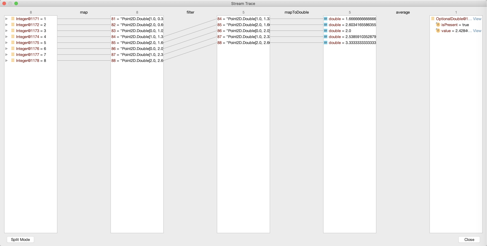

## 带你吃透课程中Java 8的那些重要知识点
- Lambda表达式：LambdaTest
- 使用Java8简化代码：CoolStreamTest、CoolOptionalTest
- 并行流：ParallelTest
- Stream操作详解：GenerateStreamTest、StreamDetailTest

使用IDEA的StreamTrace功能调试CoolStreamTest.stream的截图，参考[这里](https://www.jetbrains.com/help/idea/analyze-java-stream-operations.html)：

